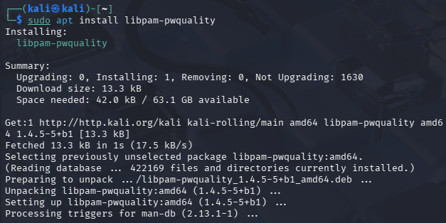
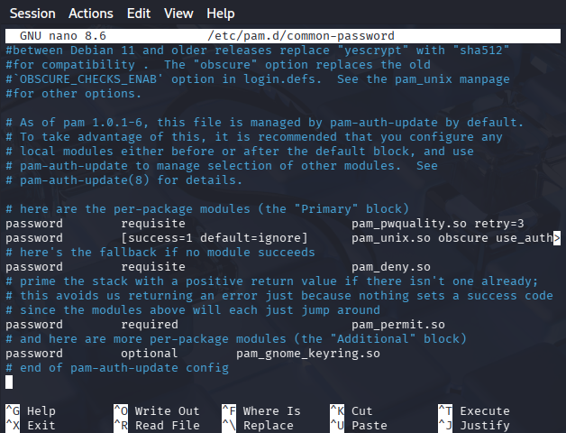
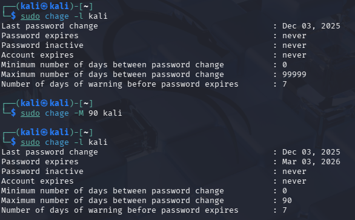
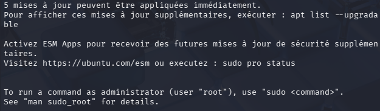
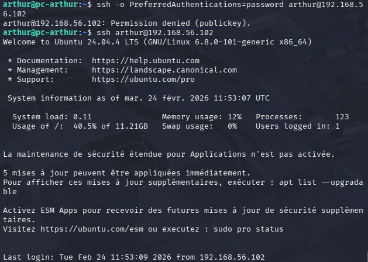

# Network Security Project: SSH Implementation and Hardening

**Subject**: Workspace Setup and Initial Environment
**Tools**: VirtualBox, Kali Linux (Client), Ubuntu (Server)

---

## Part 1A: Workspace Setup (VM Kali Linux)
### 1. Objective
The primary objective was to establish a secure and isolated laboratory environment using Kali Linux to understand fundamental security concepts, such as the CIA triad, and to practice identification and authentication mechanisms.

### 2. Implementation
* **Virtualization**: I utilized Oracle VM VirtualBox to host the infrastructure, ensuring maximum isolation from the host system.
* **Machine Deployment**: I installed a Kali Linux VM as the "Attacker/Client" and an Ubuntu VM as the "Victim/Server".
* **System Specs**: The Kali VM was configured with 4 GB of RAM and 30 GB of storage to ensure stable performance during labs.
* **Networking**: Both VMs were connected via an "Internal Network" to allow inter-VM communication while preventing unauthorized external access.

### 3. Verification
* **Login**: Successfully performed the first boot and logged in with the created student account.
* **Environment**: Confirmed the graphical interface and terminal were fully operational for the upcoming security tasks.

---

## Part 1B: Password Policy Implementation (Complexity and Renewal)

### 1. Objective
The objective of this section was to implement a robust password policy on a Linux system by configuring complexity requirements and renewal rules to protect against brute-force and dictionary attacks.

### 2. Theoretical Background
* **Complexity**: A strong policy requires a minimum length and a mix of character types (uppercase, lowercase, digits, and special characters).
* **PAM (Pluggable Authentication Modules)**: This modular system manages authentication in Linux. We specifically use the `pam_pwquality` module to enforce password strength rules.
* **Expiration**: Forcing password changes limits the window of opportunity for an attacker using a compromised credential.

### 3. Implementation Steps

* **Step 1: Installation of pwquality Tools**
I first updated the package repository and installed the necessary libraries for password quality management.

* **Step 2: Configuring Complexity Rules**
I edited the `/etc/security/pwquality.conf` file to define the global policy:
  * `minlen = 12`: Minimum length of 12 characters.
  * `minclass = 4`: Requires four classes of characters.
  * `ucredit, lcredit, dcredit, ocredit = -1`: Requires at least one uppercase, one lowercase, one digit, and one special character.

* **Step 3: Integration with PAM**
To apply these rules during password changes, I modified `/etc/pam.d/common-password` to include the `pam_pwquality.so` module with a retry limit of 3.

* **Step 4: Configuring Password Expiration (Aging)**
I modified the `/etc/login.defs` file to set the default expiration for new users to 90 days (`PASS_MAX_DAYS 90`).

### 4. Testing the Policy
I performed various tests to ensure the policy was active:
* **Failure Tests**: I attempted to set passwords that were too short or lacked required character classes. The system correctly returned "BAD PASSWORD" errors.
* **Success Test**: I successfully updated the password only when all complexity requirements were met.

### 5. Forced Expiration for Existing Users
Finally, I used the `chage` command to force an immediate password reset for the user, verifying that the system prompts for a change upon the next login attempt.

And here, when I try to reconnect for the first time :

---

## Part 1C: SSH Key-Based Authentication and Hardening

### 1. Objective
The goal of this section was to secure SSH access by implementing public-key authentication and disabling password-based logins. Key-based authentication is significantly more robust against brute-force and dictionary attacks than traditional passwords.

### 2. Prerequisites
* **Client**: Kali Linux machine.
* **Server**: Ubuntu machine.
* **Connectivity**: Both VMs must be able to communicate over the internal network.

### 3. Implementation Steps

* **Step 1: Generating the SSH Key Pair**
On the Kali Linux client, I generated a secure asymmetric key pair using the Ed25519 algorithm. I also set a passphrase to protect the private key in case of local compromise.

* **Step 2: Identifying the Target Server**
I verified the IP address of the Ubuntu server to ensure correct delivery of the public key. The server's IP was identified as `192.168.56.102`.

* **Step 3: Deploying the Public Key**
I transferred the public key to the Ubuntu server using the `ssh-copy-id` command. This automatically adds the key to the `~/.ssh/authorized_keys` file on the target.

* **Step 4: Testing Key-Based Login**
I initiated an SSH session from Kali. The system successfully requested the passphrase for the private key instead of the user password, granting access to the Ubuntu shell.

* **Step 5: Disabling Password Authentication (Hardening)**
To complete the hardening process, I modified the SSH daemon configuration on the Ubuntu server. I edited `/etc/ssh/sshd_config` to set `PasswordAuthentication no`.

### 4. Final Security Validation
To verify the hardening, I performed two final tests:
* **Negative Test**: Attempted to force a password login. The server correctly rejected the attempt with `Permission denied (publickey)`.
* **Positive Test**: Logged in again using the SSH key, which remains the only authorized access method.

---