# Network Security Project: SSH Implementation and Hardening

**Subject**: Workspace Setup and Initial Environment
**Tools**: VirtualBox, Kali Linux (Client), Ubuntu (Server)

---

## Part 1A: Workspace Setup (VM Kali Linux)
### 1. Objective
The primary objective was to establish a secure and isolated laboratory environment using Kali Linux to understand fundamental security concepts, such as the CIA triad, and to practice identification and authentication mechanisms.

### 2. Implementation
* **Virtualization**: I utilized Oracle VM VirtualBox to host the infrastructure, ensuring maximum isolation from the host system.
* **Machine Deployment**: I installed a Kali Linux VM as the "Attacker/Client" and an Ubuntu VM as the "Victim/Server".
* **System Specs**: The Kali VM was configured with 4 GB of RAM and 30 GB of storage to ensure stable performance during labs.
* **Networking**: Both VMs were connected via an "Internal Network" to allow inter-VM communication while preventing unauthorized external access.

### 3. Verification
* **Login**: Successfully performed the first boot and logged in with the created student account.
* **Environment**: Confirmed the graphical interface and terminal were fully operational for the upcoming security tasks.

---

## Part 1B: Password Policy Implementation (Complexity and Renewal)

### 1. Objective
The objective of this section was to implement a robust password policy on a Linux system by configuring complexity requirements and renewal rules to protect against brute-force and dictionary attacks.

### 2. Theoretical Background
* **Complexity**: A strong policy requires a minimum length and a mix of character types (uppercase, lowercase, digits, and special characters).
* **PAM (Pluggable Authentication Modules)**: This modular system manages authentication in Linux. We specifically use the `pam_pwquality` module to enforce password strength rules.
* **Expiration**: Forcing password changes limits the window of opportunity for an attacker using a compromised credential.

### 3. Implementation Steps

* **Step 1: Installation of pwquality Tools**
I first updated the package repository and installed the necessary libraries for password quality management.

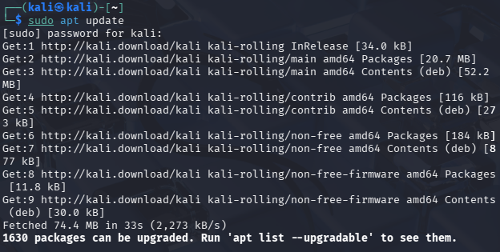
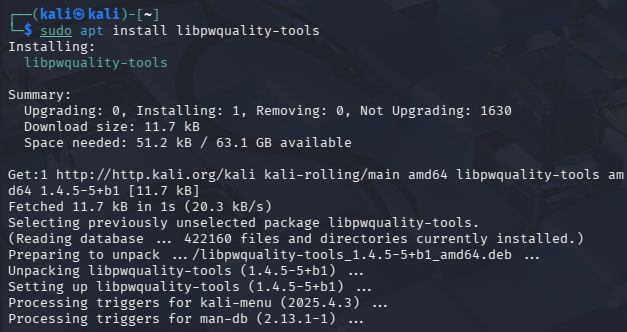

* **Step 2: Configuring Complexity Rules**
I edited the `/etc/security/pwquality.conf` file to define the global policy:
  * `minlen = 12`: Minimum length of 12 characters.
  * `minclass = 4`: Requires four classes of characters.
  * `ucredit, lcredit, dcredit, ocredit = -1`: Requires at least one uppercase, one lowercase, one digit, and one special character.

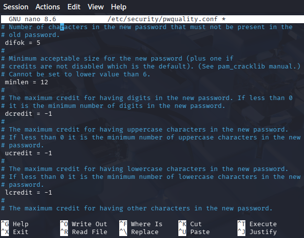

* **Step 3: Integration with PAM**
To apply these rules during password changes, I modified `/etc/pam.d/common-password` to include the `pam_pwquality.so` module with a retry limit of 3.

* **Step 4: Configuring Password Expiration (Aging)**
I modified the `/etc/login.defs` file to set the default expiration for new users to 90 days (`PASS_MAX_DAYS 90`).

### 4. Testing the Policy
I performed various tests to ensure the policy was active:
* **Failure Tests**: I attempted to set passwords that were too short or lacked required character classes. The system correctly returned "BAD PASSWORD" errors.
* **Success Test**: I successfully updated the password only when all complexity requirements were met.

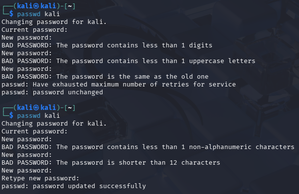

### 5. Forced Expiration for Existing Users
Finally, I used the `chage` command to force an immediate password reset for the user, verifying that the system prompts for a change upon the next login attempt.

And here, when I try to reconnect for the first time :

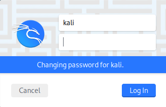

---

## Part 1C: SSH Key-Based Authentication and Hardening

### 1. Objective
The goal of this section was to secure SSH access by implementing public-key authentication and disabling password-based logins. Key-based authentication is significantly more robust against brute-force and dictionary attacks than traditional passwords.

### 2. Prerequisites
* **Client**: Kali Linux machine.
* **Server**: Ubuntu machine.
* **Connectivity**: Both VMs must be able to communicate over the internal network.

### 3. Implementation Steps

* **Step 1: Generating the SSH Key Pair**
On the Kali Linux client, I generated a secure asymmetric key pair using the Ed25519 algorithm. I also set a passphrase to protect the private key in case of local compromise.

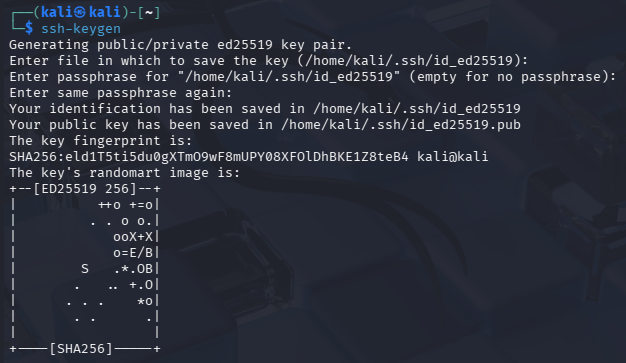

* **Step 2: Identifying the Target Server**
I verified the IP address of the Ubuntu server to ensure correct delivery of the public key. The server's IP was identified as `192.168.56.102`.

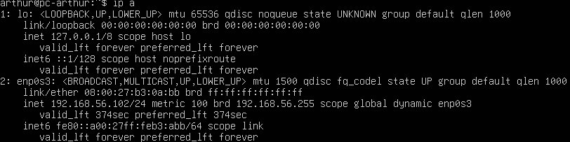

* **Step 3: Deploying the Public Key**
I transferred the public key to the Ubuntu server using the `ssh-copy-id` command. This automatically adds the key to the `~/.ssh/authorized_keys` file on the target.

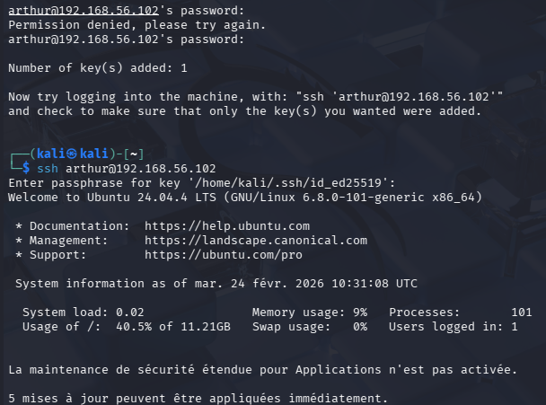

* **Step 4: Testing Key-Based Login**
I initiated an SSH session from Kali. The system successfully requested the passphrase for the private key instead of the user password, granting access to the Ubuntu shell.

* **Step 5: Disabling Password Authentication (Hardening)**
To complete the hardening process, I modified the SSH daemon configuration on the Ubuntu server. I edited `/etc/ssh/sshd_config` to set `PasswordAuthentication no`.

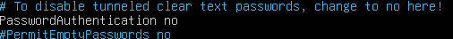

### 4. Final Security Validation
To verify the hardening, I performed two final tests:
* **Negative Test**: Attempted to force a password login. The server correctly rejected the attempt with `Permission denied (publickey)`.
* **Positive Test**: Logged in again using the SSH key, which remains the only authorized access method.

---

## Part 1D: Introduction to Attack and Testing Tools (Wireshark)

### 1. Objective
The goal of this section was to master network traffic analysis using Wireshark. By capturing real-time communications, we aim to understand the structure of network protocols and identify key information within the data exchange between the Kali client and the Ubuntu server.

### 2. Traffic Capture and Filtering
* **Capture Setup**: Wireshark was launched with administrative privileges to monitor the `eth0` interface (linked to the internal network).
* **Traffic Generation**: I initiated a ping test from Kali (`192.168.56.101`) to the Ubuntu server (`192.168.56.102`).
* **Protocol Filtering**: To isolate the relevant traffic among other background network noise, I applied the `icmp` filter in the display bar. This successfully displayed the sequence of Echo requests and replies.

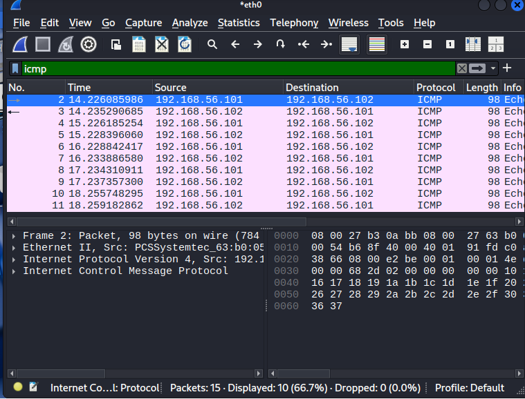

### 3. Deep Packet Inspection (DPI)
Following the exercise requirements, I performed a detailed analysis of the captured packets across three distinct panes:

* **Frame & Packet Details**:
    * **Layer 3 (IP)**: I identified the Source IP address as `192.168.56.101` and the Destination IP address as `192.168.56.102`.
    * **Layer 4 (ICMP)**: I analyzed the message types. Packet No. 2 was identified as an **"Echo (ping) request"**, while Packet No. 3 was identified as the corresponding **"Echo (ping) reply"**.

* **Packet Bytes Analysis**:
By examining the bottom pane, I observed the raw data of the ICMP packet in hexadecimal and ASCII representation. This view allowed for the verification of the payload data sent within the ICMP message, confirming the integrity of the communication.

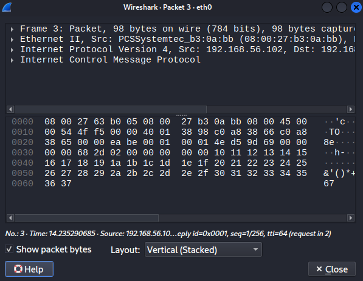

### 4. Observations
The analysis confirmed that the network communication is functioning correctly. The ability to see the source/destination addresses and the raw hexadecimal content demonstrates that even simple protocols like ICMP can be fully audited with the right tools.

### 5. Network Reconnaissance with Nmap
Following the traffic analysis, I used **Nmap (Network Mapper)** to evaluate the attack surface of the Ubuntu server. 
Nmap is a fundamental tool for discovering active hosts, open ports, and identifying running services.

#### A. Stealth SYN Scan (-sS)
I performed a **TCP SYN scan**, which is often called a "stealth" scan because it does not complete the full TCP three-way handshake.
* **Command**: `nmap -sS 192.168.56.102`
* **Results**: The scan identified that port **22/tcp (ssh)** is **open**. It also reported that 999 other ports were closed.

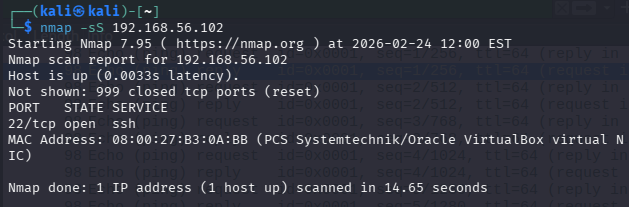

#### B. Fast Scan (-F)
To demonstrate efficiency, I executed a "Fast" scan, which limits the discovery to the most common ports instead of the default 1,000.
* **Command**: `nmap -F 192.168.56.102`
* **Results**: The scan quickly confirmed the open status of the SSH service while ignoring 99 closed ports.

#### C. Service and Version Detection (-sV)
To identify the specific software version running on the server, I used the version detection flag. This is critical for assessing vulnerabilities associated with specific releases.
**Command**: `nmap -sV 192.168.56.102` 
* **Findings**:
    * **Service**: `ssh`
    * **Version**: `OpenSSH 9.6p1 Ubuntu 3ubuntu13.14`
    * **Operating System**: Correctly identified as `Linux`.

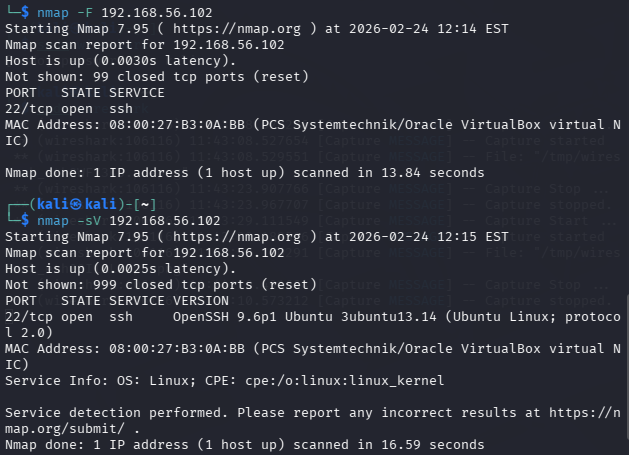

### 6. Reconnaissance Synthesis
The comparison of these scans demonstrates the trade-off between speed and depth. While the SYN scan is fast and stealthy, the version detection scan provides the essential details needed for a security audit. We have confirmed that our hardening in Part 1C worked: the SSH service is reachable, but it remains the only visible entry point on the network.

---

## Part 1E: Implementation of Basic Protection (Firewall)

### 1. Objective
The goal of this section was to understand fundamental firewall concepts and learn how to configure a basic filtering system using `iptables`.
The primary objective was to control incoming traffic to protect the Ubuntu server by allowing only essential services.

### 2. Implementation Steps on Ubuntu Server

* **Step 1: Checking Initial Status**
I first verified the default `iptables` configuration. The chains were initially empty with a default policy set to `ACCEPT`.

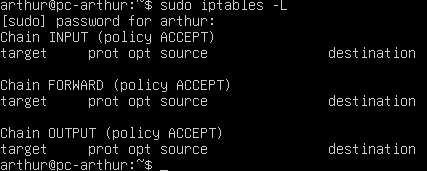

* **Step 2: Blocking ICMP Traffic (Ping)**
To prevent network reconnaissance via ping, I added a rule to the `INPUT` chain to silently drop all incoming ICMP echo-requests using the command:
`sudo iptables -A INPUT -p icmp --icmp-type echo-request -j DROP`.

* **Step 3: Verification of the Rules**
I verified the application of the new rule by listing the active `iptables` configuration. The output confirmed that any ICMP echo-request is now targeted for a `DROP` action.

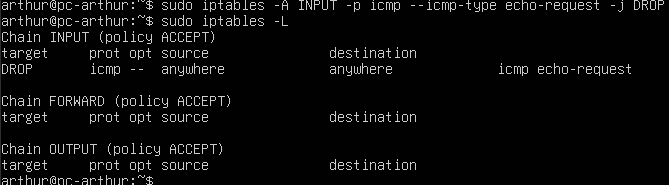

### 3. Verification of Effectiveness (from Kali)
To validate the protection, I attempted to ping the Ubuntu server from the Kali machine:
* **Result**: The test resulted in **100% packet loss**. 
* **Observation**: As shown in the statistics, 99 packets were transmitted and 0 were received. This proves that the firewall successfully intercepts and discards the traffic, making the server "invisible" to basic connectivity checks.

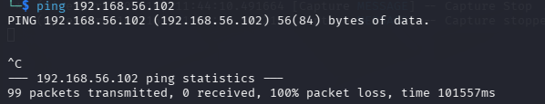

* **Step 4: Authorizing Essential Services (SSH)**
To prevent being locked out of the server when applying more restrictive rules, I explicitly authorized incoming SSH traffic on port 22:
`sudo iptables -A INPUT -p tcp --dport 22 -j ACCEPT`.
This rule ensures that even if the security policy becomes stricter, administrative access remains guaranteed.

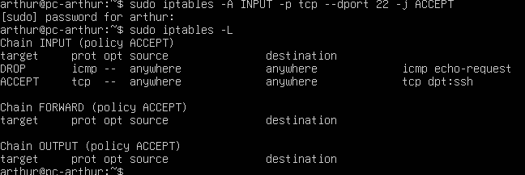

* **Step 5: Connection Verification from Kali**
I performed a connectivity test from the Kali machine to ensure the firewall configuration does not interfere with authorized access:
* **Test**: `ssh <username>@192.168.56.102`
* **Result**: The connection was successful, and the server was accessed using the Ed25519 security keys.
* **Observation**: This proves that the firewall is correctly filtering traffic by dropping pings while allowing encrypted SSH tunnels.

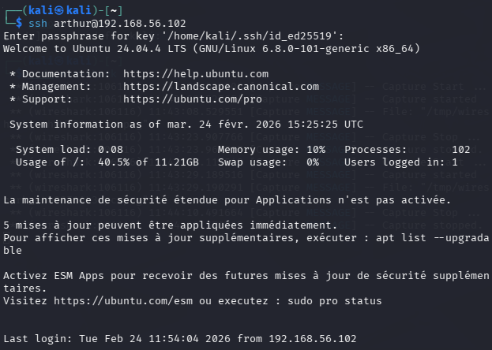

* **Step 6: Resetting the Firewall Configuration**
After completing the tests, I learned how to reset the `iptables` configuration to its original state. This is a critical procedure for troubleshooting or re-applying a new security policy.
* **Commands used**:
  1. `sudo iptables -F`: Flushes all rules in the current chains.
  2. `sudo iptables -X`: Deletes any user-defined chains.
  3. `sudo iptables -P INPUT ACCEPT`: Resets the default policy to allow all traffic.
  
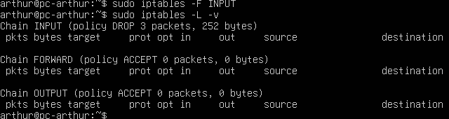

### 4. Default Policy Analysis (Going Further)
Following the laboratory instructions, I analyzed the impact of modifying the default chain policy:
* **Observation**: My server uses a permissive default policy (`ACCEPT`). While I added specific `DROP` rules, a more robust "Whitelisting" approach would be to set the default policy to `DROP` (`sudo iptables -P INPUT DROP`).
* **Precaution**: It is essential to emphasize that an `ACCEPT` rule for port 22 must be active before changing the default policy to `DROP`, otherwise all remote access would be immediately lost.

---

## Conclusion of Part 1

This first part of the project allowed for the implementation of a secure and audited server environment. 

1. **Server Hardening**: By configuring the SSH service to use Ed25519 key-based authentication and disabling password logins, I significantly reduced the risk of brute-force attacks.
2. **Network Audit**: Using Wireshark and Nmap provided a clear understanding of network protocols (ICMP) and the server's attack surface, allowing for the identification of specific service versions like OpenSSH 9.6p1.
3. **Traffic Control**: Finally, the implementation of `iptables` demonstrated how to define a precise security perimeter, making the server "stealthy" to reconnaissance tools while maintaining reliable administrative access.

These foundational steps establish a robust security baseline, essential before deploying any web services or sensitive applications.

---