# Network Security Project: Access Control and Cryptography

**Subject**: Access Control and OpenSSL Encryption
**Author**: Badr TAJINI - Information Systems Security - ECE 2025-2026
**Tools**: Kali Linux (VM), OpenSSL

---

## Part 2A: Linux Permission Configuration

### 1. Objective
The objective of this section is to understand the Linux permission model, which is based on users, groups, and others. By using management commands like `chmod`, `chown`, and `chgrp`, the goal is to configure permissions so that each user has only the minimum rights necessary to perform their tasks. This applies the principle of least privilege, thereby reducing security risks in case of compromise.

### 2. Implementation Steps

* **Step 1: Creating Users and Groups**
To simulate a realistic environment, I ensured the existence of multiple users (`user2`, `user3`) and a specific group (`dev`). I then added both users to the `dev` group using the `usermod -aG` command and verified their group memberships using the `groups` command.

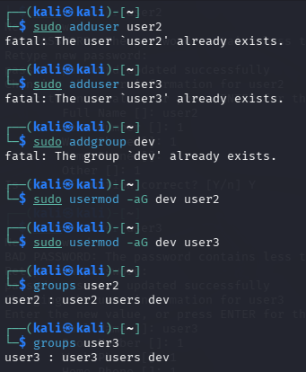

* **Step 2: Creating Test Files and Directories**
I created a directory named `test_dir` using `mkdir` and a file named `test_file.txt` using `touch`. I injected some sample text ("Contenu Lignere & Lauzanne") into the file using the `echo` command. I then used `ls -l` and `ls -ld` to display their default permissions.

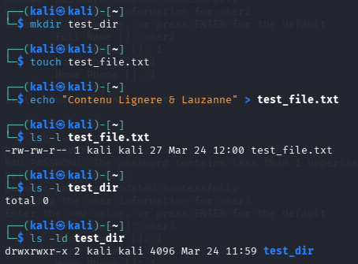

* **Step 3: Changing Ownership and Modifying Permissions**
I used the `chown` and `chgrp` commands to change the ownership of the file to `user2` and the group of the directory to `dev`. To enforce strict access control, I used the `chmod` command to modify the permissions. I applied the numeric mode `600` on `test_file.txt` to grant read/write access only to the owner, and the symbolic mode `g=rwx` on `test_dir` to grant full access to the group.

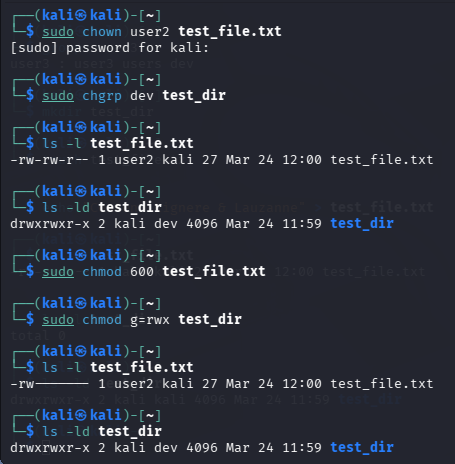

* **Step 4: Consolidating Ownership and Testing Access Restrictions**
I combined the user and group assignment on the file using `sudo chown user2:dev test_file.txt`. To verify the "least privilege" principle, I switched to `user3` using the `su` command. When `user3` attempted to read `test_file.txt` using `cat`, the system correctly returned a `Permission denied` error, proving that the `600` permission constraint is effective.

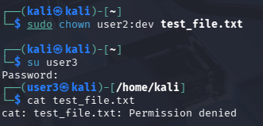

* **Step 5: Verifying Directory Traversal Permissions**
To further test directory permissions, the test files were moved to the `/tmp/` directory. Logging back in as `user3`, I verified that reading `test_file.txt` remained prohibited. However, because `user3` belongs to the `dev` group, and the `test_dir` has `rwx` permissions for the group, `user3` was successfully able to navigate into `test_dir` using the `cd` command.

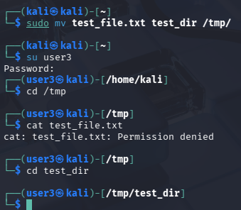

---

## Part 2B: Basic Encryption with OpenSSL

### 1. Objective
This section focuses on understanding symmetric encryption principles, where the identical key is used to both encrypt and decrypt data. The objective is to learn how to use the OpenSSL command-line tool to protect file confidentiality utilizing robust algorithms like AES.

### 2. Implementation Steps

* **Step 1: Data Preparation and Encryption**
I created a file named `secret.txt` containing confidential text ("ceci est un message confidentiel"). I then utilized the `openssl enc` command with the `aes-256-cbc` algorithm to encrypt it. The `-e` flag was used to specify an encryption operation, and the password was passed via the `-k` flag (`ma_super_cle_secret`).

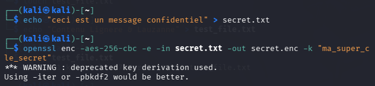

* **Step 2: Visualizing the Encrypted File**
To verify that the encryption process successfully obfuscated the data, I attempted to read the `secret.enc` output file using the `cat` command. As expected, the output consisted of completely unreadable characters, confirming the data was secured.

* **Step 3: Decrypting the File and Verification**
To recover the original data, I executed the OpenSSL decryption process using the `-d` flag to indicate a decryption operation with the exact same algorithm (`aes-256-cbc`) and password. The output was saved to `secret_dechiffre.txt`. By reading this final file with `cat`, I verified that the decrypted content perfectly matched the original confidential text.

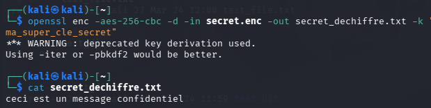

## Part 2C: Creation and Manipulation of Self-Signed Certificates

### 1. Objective
The goal of this section is to understand the role of digital certificates in authentication and encryption, specifically in contexts like HTTPS or VPNs. The objective is to use OpenSSL to generate an asymmetric RSA key pair, create a Certificate Signing Request (CSR), generate a self-signed certificate, and manipulate these files (format conversion and key extraction). 

---

### 2. Implementation Steps

* **Step 1: Generating a Private Key**
I started by generating a 2048-bit RSA private key using the `openssl genrsa` command. The output was saved as `cle_privee.pem`. I used `ls -l` to verify its creation. This key is the foundation of the server's identity and must remain strictly confidential.

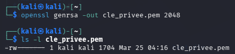

* **Step 2: Generating the Certificate Signing Request (CSR)**
Using the private key, I generated a CSR (`requete.csr`) via the `openssl req -new` command. During the interactive prompt, I provided the necessary identity attributes (Country, State, Organization). Crucially, I set the "Common Name" (CN) to `serveur-kali.local`, which represents the domain/identity the certificate will protect.

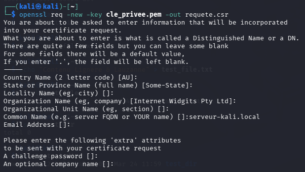

* **Step 3: Generating the Self-Signed Certificate**
Since there is no external Certificate Authority (CA) in this lab environment, I used my own private key to sign the CSR and generate an X.509 certificate. I ran the `openssl x509 -req` command, setting the validity period to 365 days, and outputting the final certificate as `certificat.crt`.

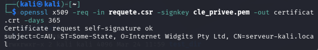

* **Step 4: Visualizing the Certificate Details**
To verify the contents of the generated certificate, I used the `openssl x509 -text -noout` command. This displayed all the embedded information in human-readable text, including the Issuer, Validity dates, Subject (matching the CN provided earlier), and the details of the Public Key Algorithm.

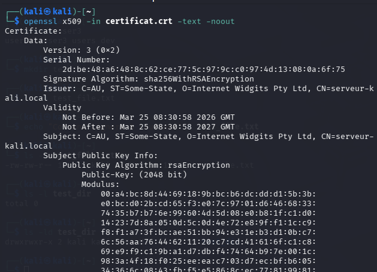

* **Step 5: Manipulating Certificates (Conversion and Extraction)**
Finally, I practiced certificate manipulation. First, I converted the PEM-formatted certificate into a binary DER format using the `-outform DER` flag. Then, I successfully extracted just the public key from the certificate using the `-pubkey` flag and redirected the output to `cle_publique.pem`.

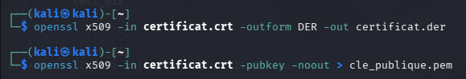

### 3. Observations on Limitations
While these self-signed certificates perfectly demonstrate the underlying cryptographic mechanisms, it is important to note their limitations. In a real-world scenario, web browsers and operating systems will flag them as untrusted because they lack a signature from a recognized, globally trusted Certificate Authority (CA).

---

## Part 2D: Setting up a VPN (OpenVPN) - Server Configuration

### 1. Objective
The objective of this final section is to understand how a Virtual Private Network (VPN) creates a secure, encrypted tunnel over an untrusted network. The initial steps involve installing OpenVPN, configuring the server parameters, and initializing a Public Key Infrastructure (PKI) using `easy-rsa` to manage the secure connections.

### 2. Implementation Steps (Server-Side)

* **Step 1: PKI Directory Initialization**
Before configuring the VPN service, I needed to set up the environment to generate the necessary cryptographic materials. I used the `make-cadir` command to create the `easy-rsa` directory. After adjusting directory ownership with `chown` to avoid permission issues, I executed `./easyrsa init-pki` to initialize the Public Key Infrastructure.

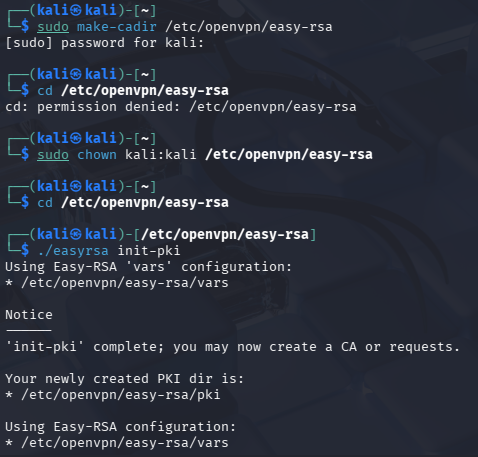

* **Step 2: Editing the Server Configuration (Certificates)**
I began editing the OpenVPN server configuration file (`server.conf`). The first crucial modification was to ensure the server correctly references the CA certificate, its own server certificate, and its private key. I verified the `ca`, `cert`, and `key` parameters were correctly pointing to the files we will generate for the server.

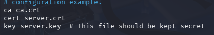

* **Step 3: Editing the Server Configuration (Routing and DNS)**
To ensure that all client network traffic is securely routed through the VPN tunnel, I uncommented the `push "redirect-gateway def1 bypass-dhcp"` directive. Additionally, I uncommented the `push "dhcp-option DNS 8.8.8.8"` line to force connected clients to use Google's DNS servers, preventing DNS leaks outside the tunnel.

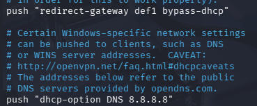

* **Step 4: Editing the Server Configuration (Privileges)**
By default, some configurations attempt to drop privileges by changing the executing user/group after startup. To prevent permission errors during this laboratory implementation, I ensured that the `user` and `group` directives were commented out (prefixed with `;`), allowing the process to run without dropping privileges prematurely.

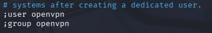

* **Step 5: Finalizing Server PKI and Certificates**
After generating the CA, the server certificate, and the Diffie-Hellman parameters, I copied `ca.crt`, `server.crt`, `server.key`, and `dh.pem` into the `/etc/openvpn/server` directory. Finally, I adjusted the ownership to `root:root` recursively to secure these highly sensitive cryptographic files.

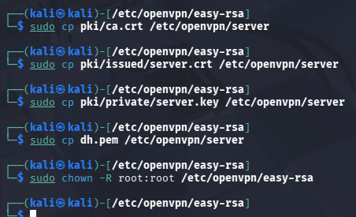

### 3. Client Configuration

* **Step 1: Generating Client Credentials**
Moving to the client setup, I generated a unique key pair and certificate for the first client using the `easy-rsa` tool with the command `./easyrsa build-client-full client1 nopass`. This generated the required `client1.key` and `client1.crt` files.

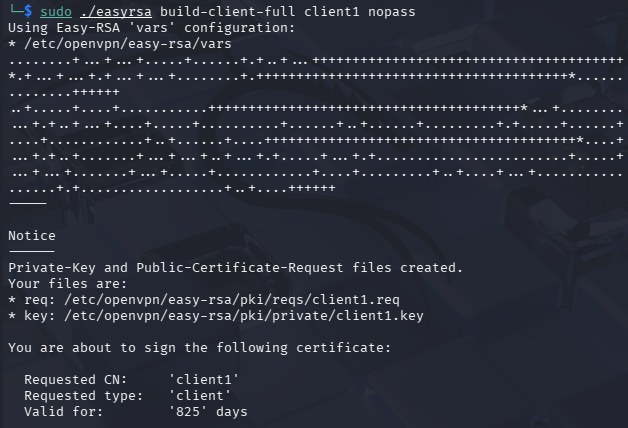

To ensure the contents were correctly generated before integration, I used the `cat` command to view the raw Base64 data of both the Certificate Authority (`ca.crt`) and the newly created client certificate (`client1.crt`).

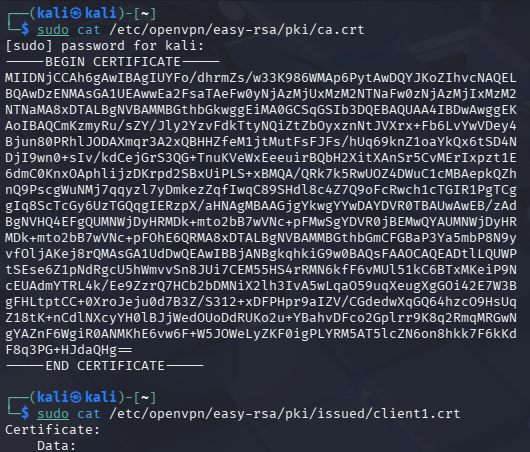

* **Step 2: Creating the Client Configuration File (.ovpn)**
I created the `client1.ovpn` configuration file using the `nano` text editor. I specified the remote server's IP address and embedded the cryptographic materials directly into the file using XML-like tags (`<ca>`, `<cert>`, `<key>`). This unified single-file format makes it extremely easy to export and load onto the host machine.

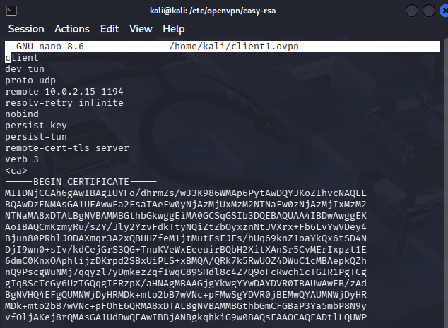

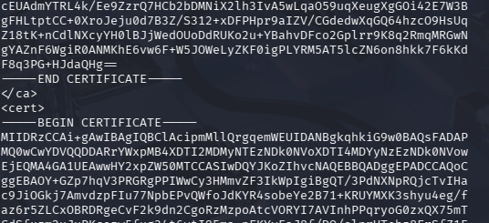

### 4. Server Activation and Deployment

* **Step 1: Starting the OpenVPN Service**
With the server configuration complete and the client profile ready, I enabled the OpenVPN service to start automatically on boot and started it immediately using the `systemctl enable` and `systemctl start` commands.

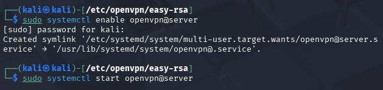

* **Step 2: Connecting from the Host Machine**
I securely transferred the `client1.ovpn` file to my physical host machine and imported it into the OpenVPN Connect client software. The connection was established successfully, indicated by the "Securely Connected!" status and the assignment of a virtual IP address on the VPN subnet.

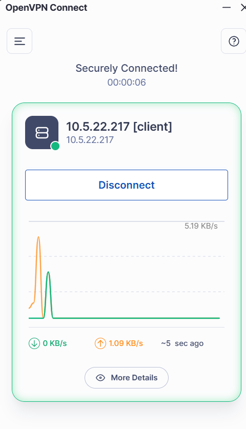

### 5. Verification

* **Step 1: Verifying Server-Side Logs**
Back on the Kali Linux server, I checked the OpenVPN terminal logs. The output confirmed a successful peer connection initiation, the dynamic IP address assignment (`10.8.0.2` for `client1`), and the successful push of routing configurations and DNS options to the client.

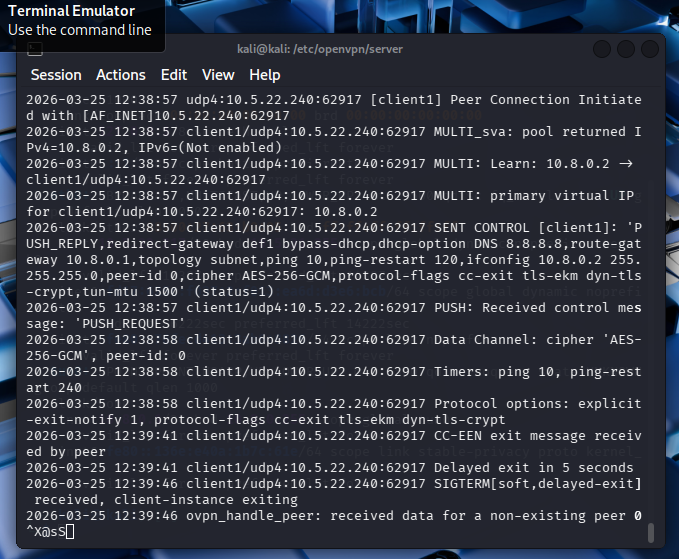

* **Step 2: Testing Tunnel Connectivity (Ping)**
To definitively prove that the encrypted tunnel was functioning and routing traffic correctly, I opened a Windows command prompt on my host machine and executed a ping test to the OpenVPN server's virtual IP address (`10.8.0.1`). The ping was 100% successful with low latency (1ms), confirming seamless bidirectional communication through the VPN interface.

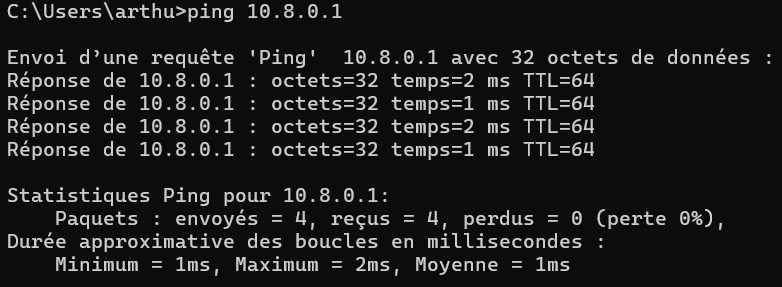

---

## Conclusion of Part 2

This second project provided extensive hands-on experience with fundamental security controls, public key infrastructure, and secure communications.

1. **Access Control**: I successfully implemented the principle of least privilege using Linux Access Control Lists (`chmod`, `chown`, `chgrp`). This highlighted the importance of strict file system permissions in preventing unauthorized local access.
2. **Cryptography & PKI**: I learned to encrypt sensitive data symmetrically using OpenSSL (AES-256-CBC) and grasped the mechanisms of asymmetric cryptography by generating self-signed X.509 certificates and RSA keys.
3. **Secure Communications**: Finally, I combined these cryptographic concepts to deploy a functional OpenVPN server. I successfully established a secure, encrypted tunnel between my host machine and the virtualized server. The successful ping test confirmed the operational status of the VPN, demonstrating a practical application of the theoretical concepts covered to protect network traffic from interception.