# Network Security Project: Network Attacks and Web Applications

**Subject**: ARP Spoofing and Web Vulnerabilities (XSS, SQLi)
**Author**: Badr TAJINI - Information Systems Security - ECE 2025-2026
**Tools**: Kali Linux (VMs), arpspoof, Wireshark

---

## Part 3A: Implementation of an ARP Spoofing Attack

### 1. Objective
[cite_start]The goal of this section was to understand the Address Resolution Protocol (ARP) and successfully perform an ARP Spoofing (Man-in-the-Middle) attack [cite: 401-409]. [cite_start]By sending forged ARP messages, the attacker forces the traffic between a victim machine and the network gateway to be redirected through the attacker's machine [cite: 405-408].

### 2. Environment Preparation
[cite_start]The laboratory utilized two Kali Linux virtual machines configured on the same internal network [cite: 378-383]. [cite_start]Using the `ip a` and `ping` commands, I identified the IP addresses and verified mutual network connectivity [cite: 397-400]. 
* **Attacker VM**: `192.168.56.101`
* **Victim VM**: `192.168.56.103`

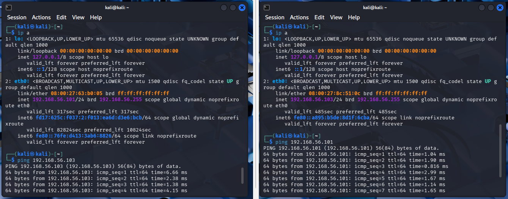

### 3. Attack Implementation
* **Step 1: Identifying the Gateway**
[cite_start]I used the `route -n` command on the attacker machine to identify the IP address of the gateway, which was `192.168.56.1` [cite: 410-412].

* **Step 2: Spoofing the Victim**
In the first terminal on the Attacker VM, I executed the `arpspoof` command to continuously send forged ARP replies to the victim. [cite_start]The command `sudo arpspoof -i eth0 -t 192.168.56.103 192.168.56.1` tricks the victim into believing that the attacker's MAC address belongs to the gateway [cite: 413-425].

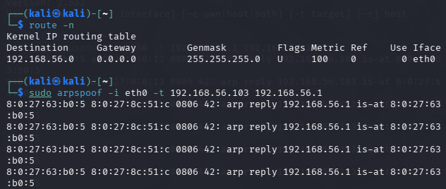

* **Step 3: Spoofing the Gateway**
To complete the Man-in-the-Middle setup, I opened a second terminal and executed the reverse command: `sudo arpspoof -i eth0 -t 192.168.56.1 192.168.56.103`. [cite_start]This tricks the gateway into believing the attacker is the victim, ensuring bidirectional traffic interception [cite: 426-429].

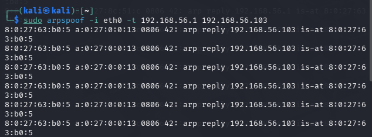

### 4. Verification
[cite_start]To definitively confirm the success of the attack, I executed the `arp -a` command on the Victim VM [cite: 431-432]. [cite_start]The output clearly showed that the IP addresses of both the gateway (`192.168.56.1`) and the attacker (`192.168.56.101`) mapped to the exact same physical MAC address (`08:00:27:63:b0:05`)[cite: 432]. This proves the victim's ARP cache was successfully poisoned.

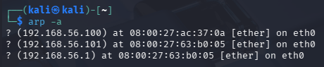

---

## Part 3B: Traffic Capture and Analysis with Wireshark

### 1. Objective
[cite_start]The objective of this section was to utilize Wireshark to capture network traffic during the ongoing attack, learn how to manipulate display filters, and analyze packet details to distinguish legitimate ARP frames from spoofed ones [cite: 449-456].

### 2. Traffic Capture and Filtering
* **Step 1: Initial Capture**
[cite_start]I launched Wireshark on the `eth0` interface of the Attacker VM while the `arpspoof` attack was running [cite: 458-464]. The raw capture displayed a massive amount of network traffic, including DHCP and broadcast packets.

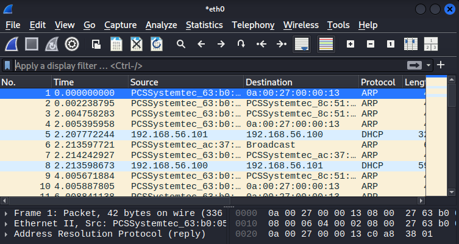

* **Step 2: Basic Protocol Filtering**
[cite_start]To isolate the relevant traffic, I applied the basic `arp` filter in the Wireshark display bar, which successfully hid all non-ARP communications [cite: 487-490].

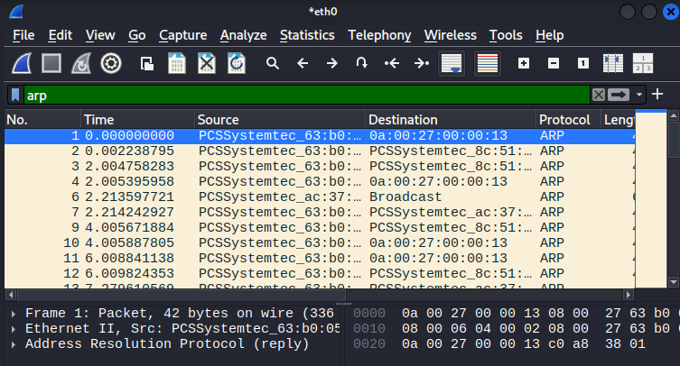

* **Step 3: Advanced IP Filtering**
[cite_start]For a more precise analysis, I applied a compound filter: `arp.dst.proto_ipv4 == 192.168.56.103 or arp.src.proto_ipv4 == 192.168.56.103` [cite: 491-494]. This restricted the view exclusively to the ARP packets originating from or targeting the Victim VM.

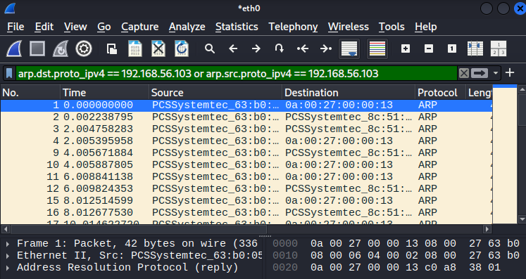

### 3. Packet Analysis
[cite_start]I selected a specific ARP reply frame for deep packet inspection [cite: 495-496]. By expanding the "Address Resolution Protocol" section in the lower pane, the mechanics of the spoofing became entirely visible: 
[cite_start]The **Sender MAC address** belonged to the Attacker (`08:00:27:63:b0:05`), but the **Sender IP address** was falsely declared as the Victim's (`192.168.56.103`) [cite: 497-500, 508]. [cite_start]This forged mapping perfectly illustrates how the attacker successfully manipulated Layer 2 communications to intercept the traffic [cite: 508-509, 517].

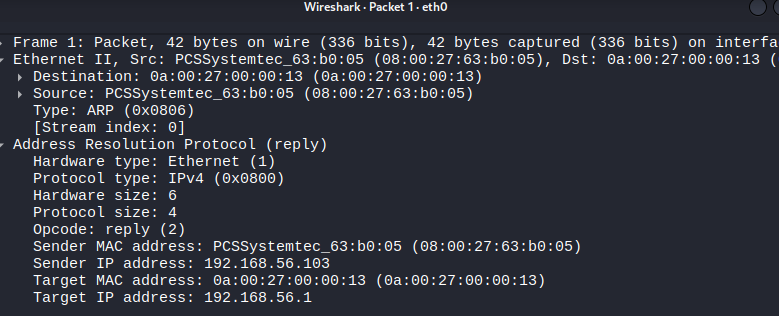

---

## Part 3C: Web Application Setup and Vulnerability Exploitation

### 1. Objective
[cite_start]The objective of this section was to deploy a vulnerable virtual machine to identify and practically exploit common web vulnerabilities, specifically Cross-Site Scripting (XSS) and SQL Injection, to better understand their underlying mechanisms and associated security risks [cite: 520-523].

### 2. Environment Preparation and Configuration
[cite_start]I deployed the Metasploitable virtual machine and configured it to reside on the same internal network as the Kali Linux attacker machine [cite: 537-538]. [cite_start]Using the `ip addr` command in the Metasploitable terminal, I identified its IP address as `192.168.56.104` [cite: 541-544].

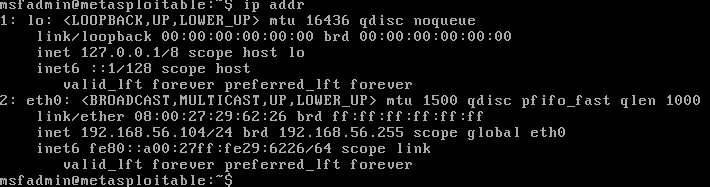

[cite_start]I then accessed the Damn Vulnerable Web Application (DVWA) via the Firefox browser at `http://192.168.56.104/dvwa` and logged in using the default administrative credentials [cite: 548-550]. [cite_start]To allow basic vulnerability exploitation, I navigated to the "DVWA Security" menu and set the security level to "Low"[cite: 551].

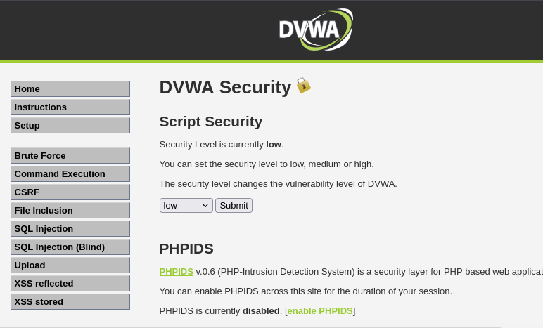

### 3. Exploiting Cross-Site Scripting (XSS)
[cite_start]I navigated to the "XSS (Reflected)" section to test if the application improperly handled user input[cite: 552]. [cite_start]I injected a simple JavaScript payload, ``, into the text field and submitted the form [cite: 554-559]. [cite_start]The browser successfully executed the injected script and displayed an alert box, confirming the presence of a reflected XSS vulnerability[cite: 563].

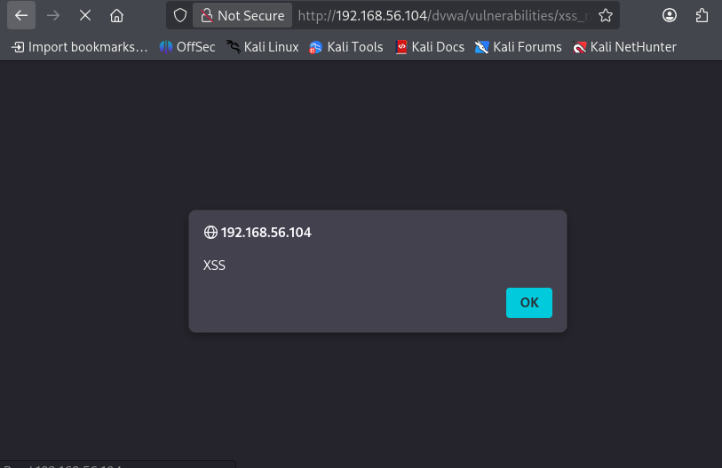

### 4. Exploiting SQL Injection (SQLi)
[cite_start]Next, I moved to the "SQL Injection" section to attempt manipulation of the backend database queries [cite: 571-574]. [cite_start]I entered the malicious payload `1' or '1'='1` into the User ID field[cite: 577]. [cite_start]Because the injected OR condition is always mathematically true, the database bypassed its standard filters and returned the entire list of user records, including administrators [cite: 574-578].

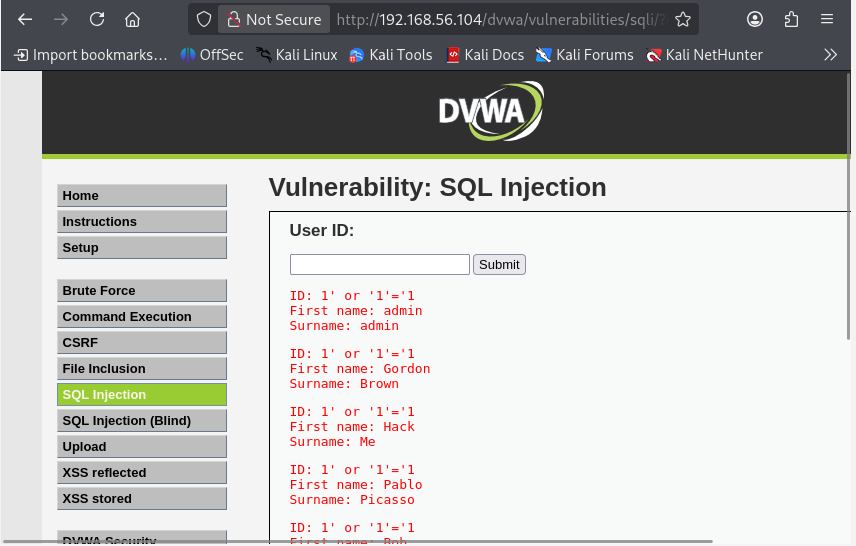

---

## Part 3D: Web Application Testing with Burp Suite

### 1. Objective
[cite_start]The goal of this final section was to introduce Burp Suite, a professional web security testing tool, to intercept, analyze, and manipulate HTTP requests "on the fly" to discover and exploit vulnerabilities [cite: 605-609].

### 2. Proxy Configuration
[cite_start]After launching Burp Suite and creating a temporary project, I configured the Firefox network settings to route traffic through a manual proxy at `127.0.0.1` on port `8080` [cite: 612-635]. [cite_start]Initially, I familiarized myself with the interface, noting the "Intercept" feature within the Proxy tab [cite: 649-650].

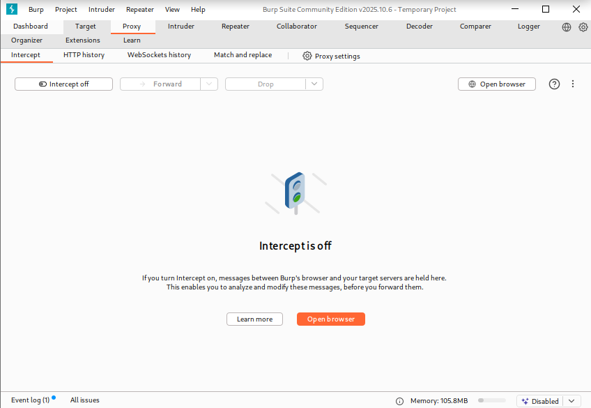

### 3. Traffic Interception
[cite_start]With "Intercept is on" activated, I submitted a standard request on the DVWA SQL Injection page [cite: 649-650]. [cite_start]Burp Suite successfully intercepted the outbound `GET` request, pausing it in the Proxy tab before it could reach the Metasploitable server[cite: 652].

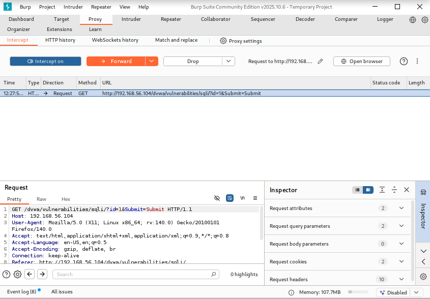

### 4. Modifying Requests with the Repeater
[cite_start]To test the vulnerability without needing to constantly reload the web browser, I sent the intercepted request to the "Repeater" tool [cite: 665-667]. [cite_start]The Repeater allows for the manual modification of request parameters and repeated testing[cite: 668]. 

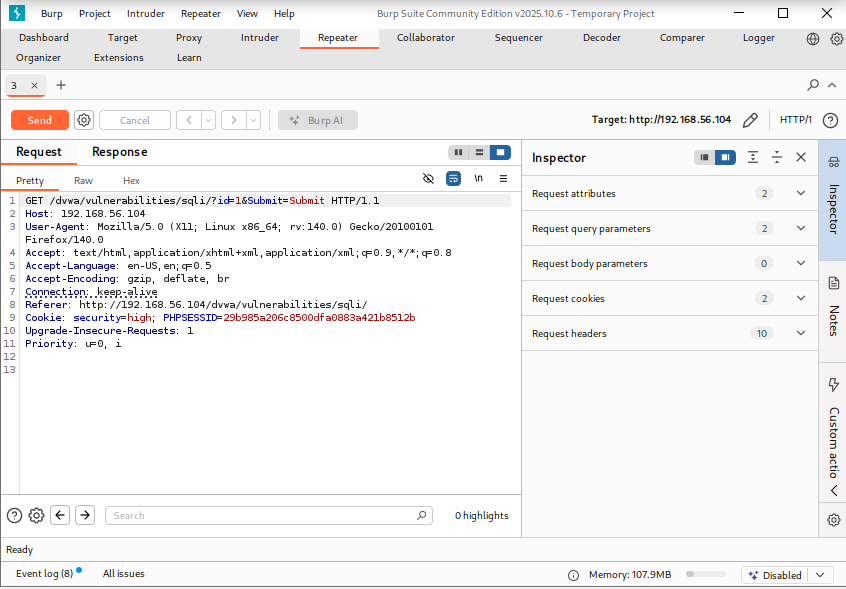

[cite_start]In the Request pane, I located the `id` parameter and replaced the standard input with a URL-encoded SQL payload (`1%27+or+1%3D1+%23`) designed to bypass the query logic[cite: 677].

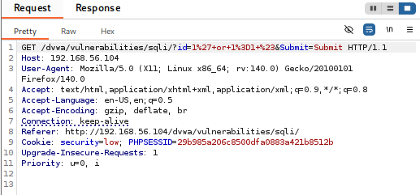

### 5. Verification and Analysis
[cite_start]After clicking "Send", I analyzed the server's HTTP response in the right pane [cite: 669-670]. [cite_start]The raw HTML output confirmed that the injection was successful, as it extracted and displayed the entire user database directly within the Burp Suite interface[cite: 678]. [cite_start]This demonstrated that manipulating HTTP requests with a proxy tool is a highly effective method for identifying and exploiting web application vulnerabilities [cite: 692-700].

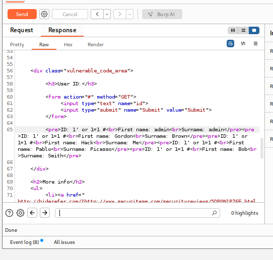