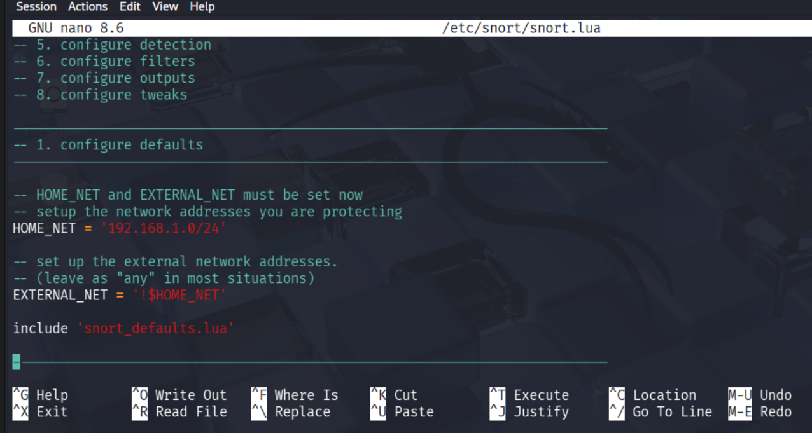
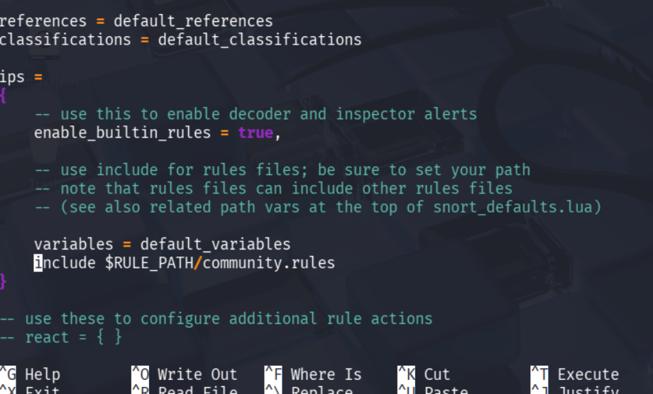
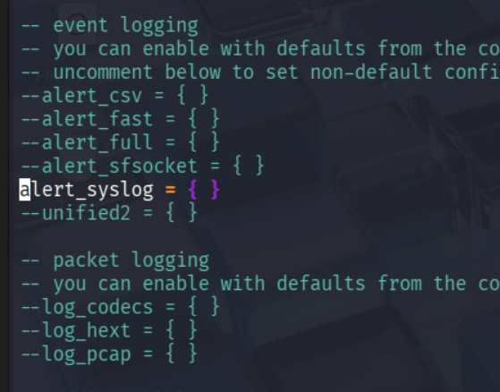
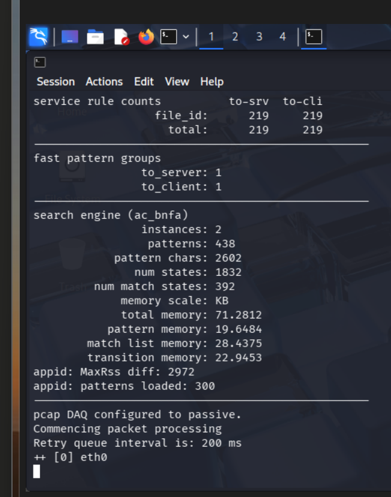

# Mini-Projet 4 — Sécurité des Réseaux et Tests d'Intrusion

---

## Partie 4A : Configuration d'un Firewall Basique

### Objectif

Configurer un pare-feu simple avec `iptables` sur chaque VM afin de contrôler le trafic réseau entrant et sortant.

---

### Environnement

| VM | Rôle | Adresse IP |
|---|---|---|
| Ubuntu Desktop | Victime | 192.168.56.105 |
| Kali Linux | Attaquant | 192.168.56.104 |
| Kali Linux (clone) | Analyseur | 192.168.56.106 |

---

### Étape 1 — Vérification de la connectivité entre les VMs

Avant de configurer le firewall, on vérifie que les trois VMs peuvent communiquer entre elles via un ping.

**Commande exécutée (depuis Kali Attaquant) :**
```bash
ping -c 3 192.168.56.105
```

> 📸 *[Screen Kali Attaquant : résultat du ping vers Ubuntu]*

---

### Étape 2 — Vérification et nettoyage des règles existantes

Sur chaque VM, on vérifie l'état actuel d'`iptables` et on supprime toutes les règles existantes pour partir d'une base propre.

**Commandes exécutées :**
```bash
sudo iptables -L -v
sudo iptables -F
```

> 📸 *[Screen Ubuntu : résultat de `iptables -L -v` avant configuration]*
> 📸 *[Screen Kali Attaquant : résultat de `iptables -L -v` avant configuration]*

---

### Étape 3 — Définition des politiques par défaut

On configure la politique par défaut : **bloquer tout le trafic entrant** et **autoriser tout le trafic sortant**.

**Commandes exécutées :**
```bash
sudo iptables -P INPUT DROP
sudo iptables -P OUTPUT ACCEPT
```

---

### Étape 4 — Autorisation du trafic loopback

Le trafic loopback est indispensable pour le fonctionnement interne de la machine.

**Commandes exécutées :**
```bash
sudo iptables -A INPUT -i lo -j ACCEPT
sudo iptables -A OUTPUT -o lo -j ACCEPT
```

---

### Étape 5 — Autorisation du trafic SSH

On autorise le port 22 (SSH) pour ne pas perdre l'accès à la VM.

**Commande exécutée :**
```bash
sudo iptables -A INPUT -p tcp --dport 22 -j ACCEPT
```

---

### Étape 6 — Autorisation de la communication entre les 3 VMs

On autorise tout le trafic provenant du réseau local `192.168.56.0/24`.

**Commande exécutée :**
```bash
sudo iptables -A INPUT -s 192.168.56.0/24 -j ACCEPT
```

---

### Étape 7 — Autorisation des ports web (optionnel)

**Commandes exécutées :**
```bash
sudo iptables -A INPUT -p tcp --dport 80 -j ACCEPT
sudo iptables -A INPUT -p tcp --dport 443 -j ACCEPT
```

---

### Étape 8 — Sauvegarde des règles

**Commandes exécutées :**
```bash
sudo mkdir -p /etc/iptables
sudo iptables-save | sudo tee /etc/iptables/rules.v4
```

---

### Étape 9 — Vérification finale

**Commande exécutée :**
```bash
sudo iptables -L -v
```

> 📸 *[Screen Ubuntu : résultat de `iptables -L -v` après configuration]*
> 📸 *[Screen Kali Attaquant : résultat de `iptables -L -v` après configuration]*

---

### Étape 10 — Test de connectivité final

**Commande exécutée (depuis Kali Attaquant) :**
```bash
ping -c 3 192.168.56.105
```

> 📸 *[Screen Kali Attaquant : ping vers Ubuntu réussi après configuration du firewall]*

---

### Résultat

| Règle | Description |
|---|---|
| `INPUT policy DROP` | Tout trafic entrant bloqué par défaut |
| `OUTPUT policy ACCEPT` | Tout trafic sortant autorisé |
| `ACCEPT lo` | Loopback autorisé |
| `ACCEPT tcp --dport 22` | SSH autorisé |
| `ACCEPT 192.168.56.0/24` | Communication inter-VMs autorisée |
| `ACCEPT tcp --dport 80/443` | Trafic web autorisé |

La configuration du firewall basique est opérationnelle sur l'ensemble des machines virtuelles.


PARTIE B



Activer les règles de base (Community Rules) :


Définir le type de sortie :


3. Lancer Snort en mode détection :
photo lancement de snort
