# Mini-Projet 4 — Sécurité des Réseaux et Tests d'Intrusion
**Auteur :** Badr TAJINI - Information Systems Security - ECE 2025-2026

---

## Partie 4A : Configuration d'un Firewall Basique

### Objectif
Configurer un pare-feu simple avec `iptables` sur chaque VM afin de contrôler le trafic réseau entrant et sortant.

---

### Environnement

| VM | Rôle | Adresse IP |
|---|---|---|
| Ubuntu Desktop | Victime | 192.168.56.105 |
| Kali Linux | Attaquant | 192.168.56.104 |
| Kali Linux (clone) | Analyseur | 192.168.56.106 |

---

### 1. Vérification de la connectivité entre les VMs

**Commande exécutée (depuis Kali Attaquant) :**
```bash
ping -c 3 192.168.56.105
```

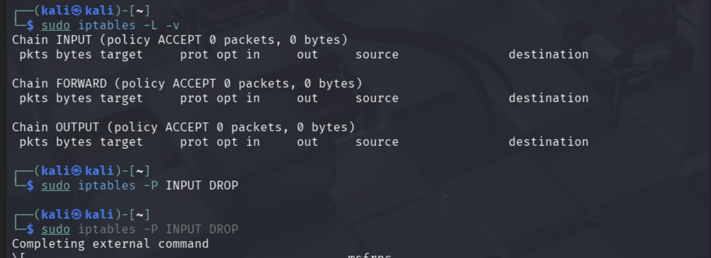

---

### 2. Vérification et nettoyage des règles existantes

**Commandes exécutées :**
```bash
sudo iptables -L -v
sudo iptables -F
```


---

### 3. Définition des politiques par défaut

**Commandes exécutées :**
```bash
sudo iptables -P INPUT DROP
sudo iptables -P OUTPUT ACCEPT
```

---

### 4. Autorisation du trafic loopback

**Commandes exécutées :**
```bash
sudo iptables -A INPUT -i lo -j ACCEPT
sudo iptables -A OUTPUT -o lo -j ACCEPT
```

---

### 5. Autorisation du trafic SSH

**Commande exécutée :**
```bash
sudo iptables -A INPUT -p tcp --dport 22 -j ACCEPT
```

---

### 6. Autorisation de la communication entre les 3 VMs + Résultat des règles 3, 4, 5

**Commande exécutée :**
```bash
sudo iptables -A INPUT -s 192.168.56.0/24 -j ACCEPT
```

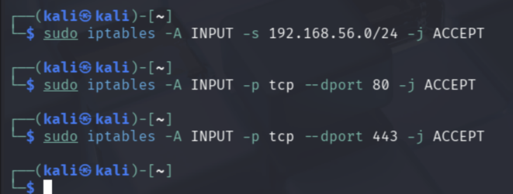

---

### 7. Autorisation des ports web

**Commandes exécutées :**
```bash
sudo iptables -A INPUT -p tcp --dport 80 -j ACCEPT
sudo iptables -A INPUT -p tcp --dport 443 -j ACCEPT
```

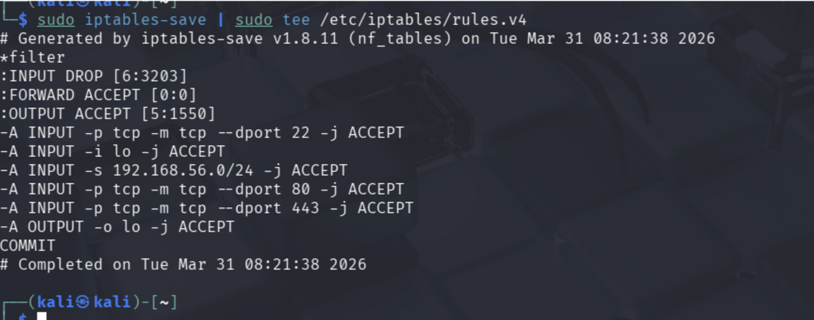

---

### 8. Sauvegarde des règles

**Commandes exécutées :**
```bash
sudo mkdir -p /etc/iptables
sudo iptables-save | sudo tee /etc/iptables/rules.v4
```

---

### 9. Vérification finale

**Commande exécutée :**
```bash
sudo iptables -L -v
```

---

### Résultat

| Règle | Description |
|---|---|
| `INPUT policy DROP` | Tout trafic entrant bloqué par défaut |
| `OUTPUT policy ACCEPT` | Tout trafic sortant autorisé |
| `ACCEPT lo` | Loopback autorisé |
| `ACCEPT tcp --dport 22` | SSH autorisé |
| `ACCEPT 192.168.56.0/24` | Communication inter-VMs autorisée |
| `ACCEPT tcp --dport 80/443` | Trafic web autorisé |

La configuration du firewall basique est opérationnelle sur l'ensemble des machines virtuelles.

---

## Partie 4B : Mise en place d'un IDS (Snort)

### Objectif
Mettre en place un système de détection d'intrusion (IDS) avec Snort et comprendre son rôle dans la surveillance du réseau.

---

### 1. Installation de Snort

**Commande exécutée :**
```bash
sudo apt update && sudo apt install snort -y
```


**Note :** Les dépôts Kali installent automatiquement **Snort 3** (version 3.12.1.0). La configuration est adaptée en conséquence.

---

### 2. Configuration de Snort (HOME_NET, EXTERNAL_NET, règles)

**Sauvegarde du fichier de configuration :**
```bash
sudo cp /etc/snort/snort.lua /etc/snort/snort.lua.bak
sudo nano /etc/snort/snort.lua
```

**Paramètres configurés :**
```lua
HOME_NET = '192.168.56.0/24'
EXTERNAL_NET = '!$HOME_NET'
```

**Chemin absolu des règles dans `snort_defaults.lua` :**
```lua
RULE_PATH = '/etc/snort/rules'
```

**Activation des règles dans la section `ips` :**
```lua
ips =
{
    enable_builtin_rules = true,
    variables = default_variables,
    include = RULE_PATH .. '/local.rules'
}
```


---

### 3. Lancer Snort en mode détection

**Commande exécutée :**
```bash
sudo snort -i eth0 -c /etc/snort/snort.lua -l /var/log/snort
```


---

### 4. Génération d'alertes et consultation des logs

**Scan depuis Kali Attaquant :**
```bash
nmap -Pn -p 1-1000 192.168.56.105
```

**Consultation des logs :**
```bash
sudo tail -f /var/log/auth.log
```


**Note :** Snort 3 utilise une syntaxe différente de Snort 2. Les fichiers de configuration sont en `.lua` au lieu de `.conf`. Le moteur de détection fonctionne correctement et écoute le trafic sur l'interface `eth0`.

---

## Partie 4C : Scan de ports et de services avec Nmap

### Objectif
Utiliser Nmap pour scanner un réseau, découvrir les ports ouverts et identifier les services.

---

### Préparation
Un serveur HTTP Python a été lancé sur Ubuntu pour exposer un service :
```bash
python3 -m http.server 8080
```

---

### 1. Scan TCP SYN

**Commande exécutée :**
```bash
nmap -sS 192.168.56.105
```

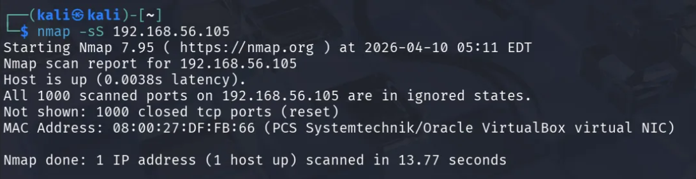

---

### 2. Scan de ports spécifiques

**Commandes exécutées :**
```bash
nmap -p 22,80,443 192.168.56.105
nmap -p 1-1000 192.168.56.105
```

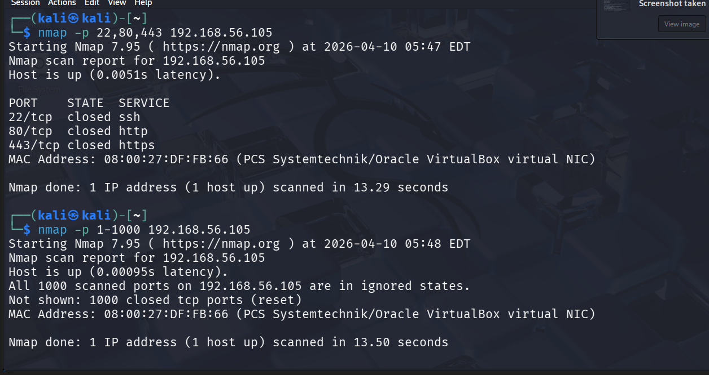

---

### 3. Scan UDP

**Commande exécutée :**
```bash
nmap -sU 192.168.56.105
```

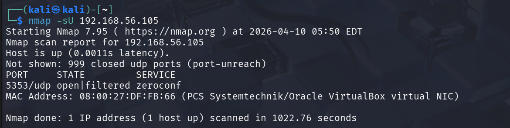

---

### 4. Détection de services

**Commande exécutée :**
```bash
nmap -sV 192.168.56.105
```

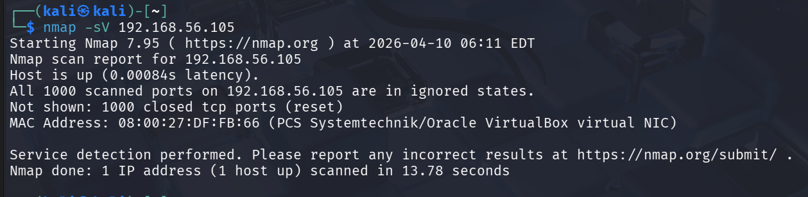

---

### 5. Détection de l'OS

**Commande exécutée :**
```bash
nmap -O 192.168.56.105
```

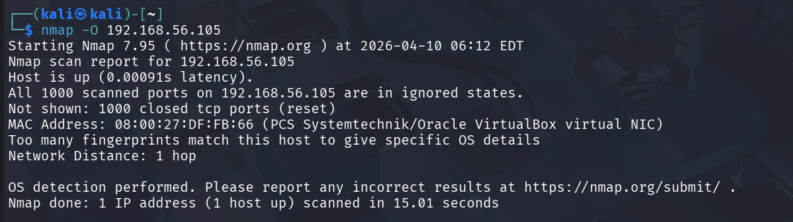

---

### 6. Scan complet combiné

**Commande exécutée :**
```bash
nmap -sS -sV -O -p 1-65535 192.168.56.105
```

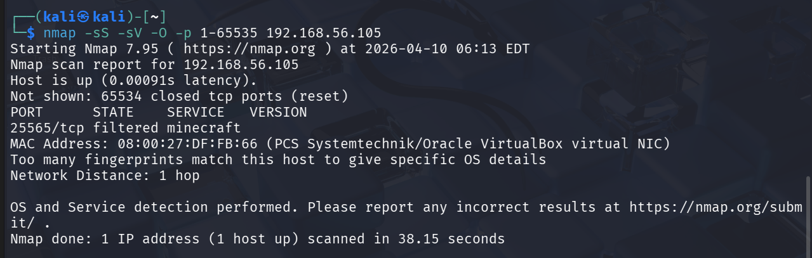

---

### Résultat et analyse

| Port | État | Service | Version |
|---|---|---|---|
| 8080/tcp | open | http | SimpleHTTPServer 0.6 (Python 3.12.3) |
| 25565/tcp | filtered | minecraft | Docker proxy |

**Observation :** Les autres ports sont fermés grâce au firewall configuré en 4A, ce qui démontre l'efficacité de notre configuration iptables.

---

## Partie 4D : Mise en place d'une attaque simple

### Objectif
Combiner les connaissances acquises pour mettre en place une attaque simple sur le service web identifié.

---

### 1. Scan de reconnaissance initial

**Commande exécutée :**
```bash
nmap -sS -sV -p 1-65535 192.168.56.105
```

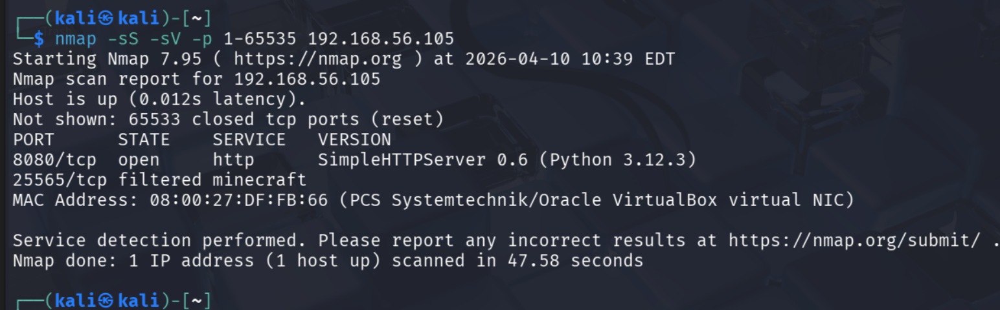

---

### 2. Analyse et choix de la cible

Le port **8080 (HTTP)** est sélectionné comme cible car :
- Il est en état **open**, donc accessible
- Il expose un serveur web Python potentiellement mal configuré
- Un serveur HTTP peut contenir des fichiers sensibles ou des répertoires non protégés

Le port 25565 est écarté car il est en état **filtered**.

---

### 3. Attaque avec dirb (énumération web)

**Commande exécutée :**
```bash
dirb http://192.168.56.105:8080
```

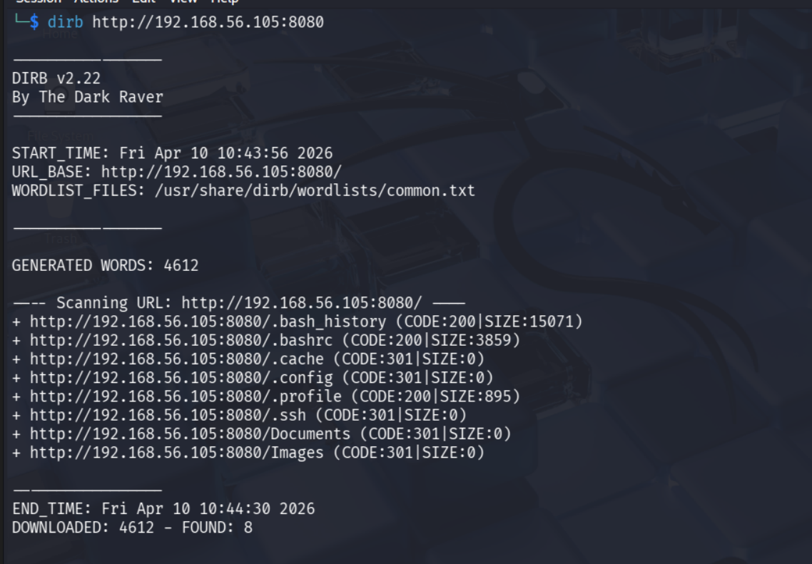

---

### 4. Analyse des résultats et rapport

dirb a testé **4612 chemins** et trouvé **8 ressources accessibles** :

| Ressource | Code | Criticité | Description |
|---|---|---|---|
| `/.bash_history` | 200 |  Critique | Historique des commandes — peut contenir des mots de passe |
| `/.bashrc` | 200 | Moyen | Configuration shell de l'utilisateur |
| `/.profile` | 200 |  Moyen | Variables d'environnement |
| `/.ssh` | 301 |  Critique | Dossier SSH — peut contenir des clés privées |
| `/.cache` | 301 |  Faible | Cache utilisateur |
| `/.config` | 301 |  Moyen | Fichiers de configuration |
| `/Documents` | 301 |  Faible | Dossier documents personnel |
| `/Images` | 301 |  Faible | Dossier images personnel |

**Vulnérabilité identifiée :** Le serveur `python3 -m http.server` expose tout le répertoire home de l'utilisateur sans authentification.

**Recommandation :** Ne jamais lancer un serveur HTTP depuis le répertoire home. Utiliser un dossier dédié avec uniquement les fichiers nécessaires.

---

## Partie 4E : Introduction au Pentest et Méthodologie

### Objectif
Comprendre la méthodologie d'un test d'intrusion et l'importance de la documentation.

---

### 1. Définition du test d'intrusion

Un test d'intrusion (pentest) est un exercice de sécurité **autorisé et légal** qui simule une attaque réelle sur un système ou un réseau, dans le but d'identifier les vulnérabilités avant qu'un attaquant malveillant ne les exploite.

| | Pentest | Hacking |
|---|---|---|
| Autorisation |  Autorisé par le propriétaire |  Non autorisé |
| Légalité |  Légal |  Illégal |
| Objectif | Améliorer la sécurité | Nuire / voler |
| Rapport |  Rapport fourni au client |  Aucun |

---

### 2. Les phases d'un test d'intrusion

#### Planification et Préparation
- Définir le périmètre du test (systèmes inclus, objectifs)
- Obtenir l'autorisation du client
- Définir le type de test (boîte noire, grise ou blanche)
- Choisir les outils et techniques

#### Reconnaissance
```bash
nmap -sS -p 1-65535 192.168.56.105
nmap -sV 192.168.56.105
nmap -O 192.168.56.105
nmap -sS -sV -O -p 1-65535 192.168.56.105
```

#### Analyse de Vulnérabilités
```bash
nmap --script vuln 192.168.56.105
```

#### Exploitation
```bash
dirb http://192.168.56.105:8080
```

#### Maintien de l'accès
Après avoir obtenu un accès, on peut tenter de maintenir cet accès dans le temps en créant un backdoor ou en ajoutant une clé SSH.

#### Reporting
Documentation de toutes les étapes, vulnérabilités identifiées et recommandations de sécurité.

---

### 3. Consolidation de la méthodologie

Dans ce projet, nous avons suivi la méthodologie complète :

1. **Reconnaissance** → Nmap pour identifier les services (`8080/tcp open http`)
2. **Analyse** → Identification du serveur Python comme cible vulnérable
3. **Exploitation** → dirb pour découvrir les ressources sensibles (`.bash_history`, `.ssh`)
4. **Reporting** → Documentation des vulnérabilités et recommandations

---

### 4. Rôle du rapport

Un rapport de pentest doit inclure :
- Un **résumé exécutif** des points principaux
- Une **description du périmètre** du test
- La **liste des outils** utilisés (Nmap, dirb, iptables, Snort)
- Une **description des vulnérabilités** identifiées
- Des **recommandations de remédiation**
- Des **recommandations de sécurité** pour améliorer la posture globale

---

### 5. Perspectives

Pour approfondir ce travail :
- Explorer **Metasploit** pour l'exploitation avancée
- S'entraîner sur des plateformes dédiées comme **HackTheBox** ou **TryHackMe**
- Approfondir l'utilisation de **Snort 3** pour la détection d'intrusion
- Étudier les techniques d'attaque avancées (SQLmap, Hydra)

---

## Conclusion

Ce mini-projet a permis de mettre en place un environnement de sécurité complet :

1. **Firewall (4A)** → Configuration d'iptables pour contrôler le trafic réseau
2. **IDS (4B)** → Installation et configuration de Snort 3 pour la détection d'intrusion
3. **Reconnaissance (4C)** → Utilisation de Nmap pour identifier les services exposés
4. **Attaque (4D)** → Exploitation d'un serveur web mal configuré avec dirb
5. **Méthodologie (4E)** → Application de la méthodologie pentest compl